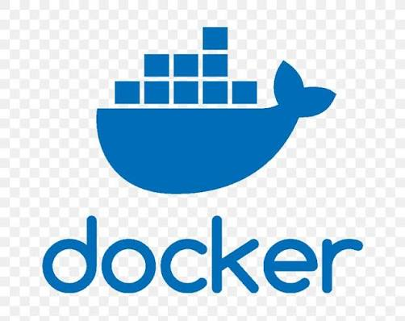
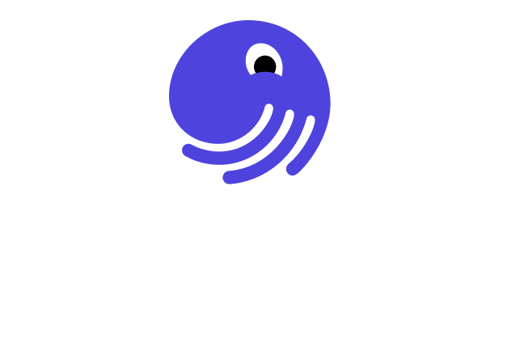
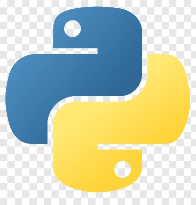
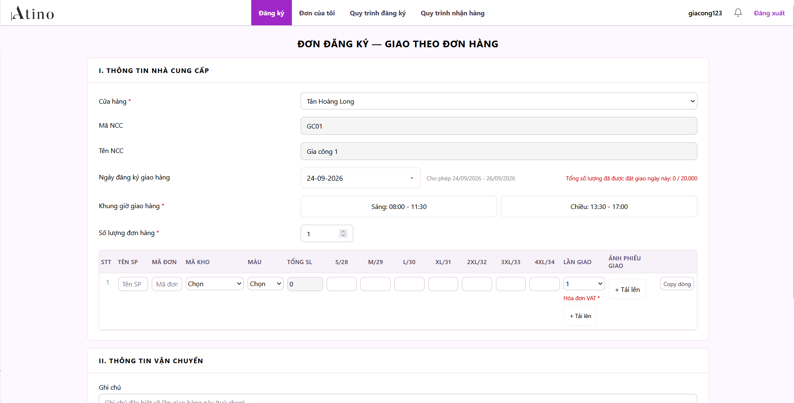
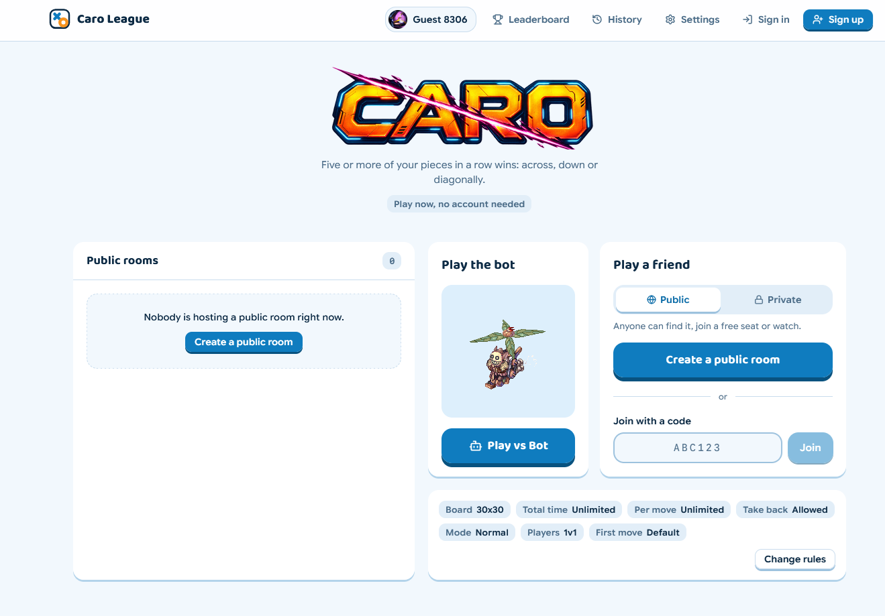
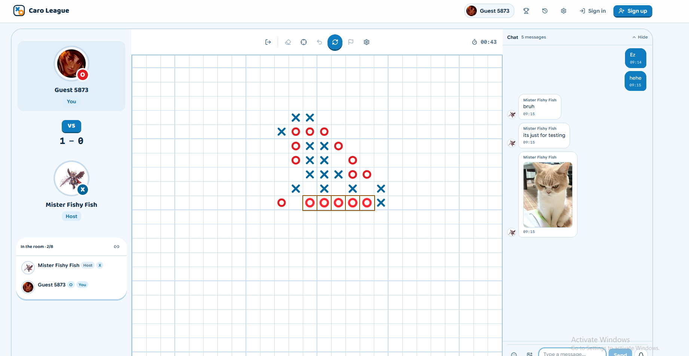

<h1 align="center">Võ Anh Duy</h1>
<h3 align="center">Chuyên viên Dữ liệu & Lập trình Kỹ thuật</h3>  

[Trang web](https://voanhduy1710.dev) | [GitHub](https://github.com/voanhduy1710) | [LinkedIn](https://www.linkedin.com/in/voanhduy1710) | [Email](mailto:voanhduy1710@gmail.com) | [CV Tiếng Anh (PDF)](CV_DA_Vo%20Anh%20Duy_EN.pdf) | [CV Tiếng Việt (PDF)](CV_DA_Vo%20Anh%20Duy_VN.pdf)

## Giới thiệu
Chuyên viên Phân tích Dữ liệu và Lập trình Kỹ thuật với hơn 5 năm kinh nghiệm thực chiến trong các lĩnh vực phân tích dữ liệu, Business Intelligence (BI), phát triển ứng dụng web full-stack và xây dựng các luồng dữ liệu ETL tự động.

Nền tảng vững chắc trong việc thiết kế và triển khai các hệ sinh thái dữ liệu toàn diện (end-to-end): từ tổng hợp, xử lý hàng trăm triệu bản ghi dữ liệu vận hành quy mô lớn, thiết kế mô hình kho dữ liệu star-schema phục vụ báo cáo quản trị, đến lập trình các nền tảng ứng dụng sản xuất (production) và hệ thống tự động hóa luồng công việc.

<h2 align="left">Công nghệ & Công cụ chính:</h2>

  
  
  
  
  
  
  
  
  
  
  
  
  
  
  
  
  
  
  
  

## Kỹ năng chuyên môn

| № | Danh mục | Công nghệ & Công cụ |
|---|------------------------------------|-----------------------------------------------------------------------------------------------------------------------------------------------------------------------------------|
| 1 | **Phát triển Full-Stack** | TypeScript, JavaScript, React, Vite, Next.js, Tailwind CSS, TanStack Query / Table, FastAPI (Python), Node.js, Express, NestJS, REST APIs, Webhooks, Supabase (PostgreSQL, Auth) |
| 2 | **Kỹ thuật Dữ liệu & Tự động hóa** | Python (Pandas, Polars, DuckDB, Dagster, Selenium, PySpark), FastAPI (Event-Driven Ingestion), REST APIs, Google Apps Script, Thu thập dữ liệu Web, Headless Automation |
| 3 | **Điện toán đám mây & DevOps** | Google Cloud Run, Google Cloud Storage (GCS), Docker, Git, GitHub Actions, Vercel |
| 4 | **Phân tích Dữ liệu & BI** | SQL (OLTP: PostgreSQL, MySQL; OLAP: DuckDB, Google BigQuery), Power BI (DAX, Star Schema Modeling, Power Query), Microsoft Excel (Hàm nâng cao, Pivot Tables, Power Pivot), Google Sheets |

---

## Kinh nghiệm làm việc

### Công ty TNHH Thời trang Atino
**Chuyên viên Full-Stack & Dữ liệu**  
*2024 – Hiện tại | Hà Nội, Việt Nam*
- Phát triển ứng dụng web tài chính full-stack (**React**, **TypeScript**, **FastAPI**, **Supabase**) tích hợp **dashboard P&L** tương tác, đối soát phê duyệt và **Lark webhook** thời gian thực giúp phát hiện chênh lệch chi tiền và trùng lặp đề nghị thanh toán.
- Xây dựng luồng tự động hóa báo cáo dòng tiền và P&L (**Python**, **BigQuery**), tự động gửi bản tin tài chính hàng ngày qua **Lark Suite** cho Ban Giám đốc (BOD) và Quản lý, cắt giảm **99%** thời gian tổng hợp thủ công.
- Thiết kế hệ thống ETL bán lẻ tự động bằng **Python** (**Polars**/**Pandas**), **Dagster Cloud** và **BigQuery**, đồng bộ và đối soát **hơn 10 triệu records/tháng** từ **Nhanh.vn ERP**, **Shopee**, **TikTok Shop**, **Facebook**, **Palexy** và **Lark Suite** (**Approval**, **Lark Base**) với độ ổn định **99.8%**.
- Xây dựng mô hình star-schema và **Power BI dashboard** tự động cập nhật hàng ngày cho chuỗi **hơn 50 cửa hàng**, theo dõi chỉ số **P&L**, biên lợi nhuận gộp và vòng quay hàng tồn kho.

### Công ty Cổ phần VWS
**Chuyên viên Phân tích Dữ liệu Kỹ thuật | Phòng Công nghệ Thông tin**  
*2021 – 2024 | Hà Nội, Việt Nam*
- Xử lý, kiểm định và chuẩn hóa chất lượng dữ liệu cho hơn **100.000.000+ records** bằng **Jupyter notebook** (**Deepnote**) và **SQL**, giảm tỷ lệ sai lệch dữ liệu từ **20% xuống dưới 2%** và đảm bảo tính toàn vẹn hệ thống.
- Phát triển các luồng tự động hóa và script tích hợp bằng **Python**, **Google Apps Script** và **VBA**, loại bỏ các tác vụ thủ công và nâng cao độ chính xác dữ liệu từ **80% lên 95%**.
- Xây dựng các công cụ nội bộ bằng **Python** và chuẩn hóa quy trình tính toán, giúp **tăng 35% năng suất** làm việc của phòng ban.

### Mosvodokanal
**Chuyên viên Phân tích Vận hành | Phòng Kế hoạch và Phân tích**  
*2018 – 2021 | Mát-xcơ-va, Nga*  
- Tổng hợp và phân tích hơn **1 tỷ records vận hành** từ **15+ khu vực dịch vụ** bằng các truy vấn **SQL** và **MySQL** tối ưu.
- Xây dựng hệ thống pipeline báo cáo và KPI dashboard cho ban điều hành bằng **SQL** và **Excel**, rút ngắn **40%** thời gian lập báo cáo và hỗ trợ ra quyết định phân bổ nguồn lực.

---

## Dự án Tiêu biểu & Sản phẩm Triển khai

### Ứng dụng Full-Stack & Hệ thống Production

#### [Web Đặt lịch Hẹn trả hàng Atino](https://github.com/voanhduy1710/Atino-booking-webapp)
*Nền tảng trực tuyến:* [giacong.atino.vn](https://giacong.atino.vn/)  

- Nền tảng logistics điều phối đặt lịch giao hàng và tiếp nhận hàng hóa kho vận quy mô doanh nghiệp, kết nối nhà cung cấp bên ngoài, người duyệt kho và thủ kho tại cổng theo thời gian thực.
- Triển khai thuật toán lập lịch PO động, logic kiểm soát công suất tiếp nhận 20.000 sản phẩm/ngày, quét mã QR qua camera tại cổng kho và tự động lưu trữ hóa đơn VAT/phiếu giao hàng lên Google Cloud Storage.
- Tích hợp phân quyền theo vai trò (RBAC), đồng bộ dữ liệu với ERP Nhanh.vn và tự động kết xuất báo cáo vận hành.

---

#### [Web Cờ Caro](https://github.com/voanhduy1710/Caro-app)
*Ứng dụng trực tuyến:* [league-of-caro.vercel.app](https://league-of-caro.vercel.app/)  

- Ứng dụng web cờ Caro nhiều người chơi theo thời gian thực, hỗ trợ ghép trận ngang hàng (P2P) qua kênh dữ liệu WebRTC.
- Tích hợp máy trạng thái (state machine) quản lý vòng đời phòng đấu, tùy chỉnh kích thước bàn cờ, xác thực tài khoản qua Supabase, bảng xếp hạng điểm ELO và minigame phân định lượt đi.

---

#### [Các dự án khác Private khác](https://github.com/voanhduy1710/Other-private-repo-previews)
Tài liệu công khai, sơ đồ kiến trúc hệ thống và giao diện xem trước của các hệ thống doanh nghiệp phát triển theo thỏa thuận bảo mật NDA:

- **Nền tảng Đặt lịch Studio QandaStudy:** Hệ thống full-stack quản lý và lập lịch tài nguyên, phòng thu.  
  
  
  
  
  
- **Nền tảng Quản trị & Phê duyệt Tài chính Atino:** Bảng điều khiển quản lý kế toán bán lẻ và hệ thống phê duyệt đa cấp độ của doanh nghiệp.  
  
  
  
  
  
- **Backend FastAPI Phê duyệt Atino:** Hệ thống REST API bất đồng bộ, xử lý sự kiện webhook Lark Suite và công cụ đồng bộ dữ liệu phân tích sang BigQuery.  
  
  
  
  
  
- **Nền tảng Dữ liệu Tác nghiệp Atino:** Nền tảng tích hợp dữ liệu bán lẻ tự động vận hành trên các pipeline Dagster Cloud, kho dữ liệu BigQuery và công cụ thu thập dữ liệu bằng trình duyệt headless Selenium.  
  
  
  
  
  
  

---

### Phân tích Dữ liệu & Business Intelligence

#### [Dự án Portfolio Phân tích Dữ liệu](https://github.com/voanhduy1710/Portfolio-projects)

Bộ sưu tập các dự án phân tích dữ liệu kinh doanh, mô hình hóa và tự động hóa:
- **Mô hình Bán lẻ Đa cửa hàng Atino:** Mô hình kho dữ liệu star-schema tích hợp hóa đơn POS đa chi nhánh, vòng quay tồn kho, tỷ lệ chuyển đổi khách hàng và hệ thống đo lường DAX toàn diện (% MoM, % YoY, Customer LTV).
- **Phân tích Hiệu quả Doanh số Adidas:** Phân tích tài chính và doanh số động theo các kênh bán hàng và dòng sản phẩm, kèm phân tích động lực biên lợi nhuận trên Excel.
- **Phân tích Chuyến đi Uber:** Phân tích điều phối thời gian và không gian sử dụng trích xuất truy vấn SQL và bản đồ nhiệt nhu cầu theo giờ trên Power BI.
- **Quản lý Chuỗi cung ứng & Tồn kho:** Dashboard tương tác theo dõi chuỗi cung ứng toàn diện: tỷ lệ đáp ứng đơn hàng, vòng quay tồn kho và phân khúc biên lợi nhuận sản phẩm.

## Ngôn ngữ

- **Tiếng Việt:** Bản ngữ
- **Tiếng Anh:** Năng lực làm việc chuyên nghiệp
- **Tiếng Nga:** Năng lực làm việc chuyên nghiệp
- **Tiếng Hàn:** Sơ cấp (Đang học)

## Học vấn

**Đại học Quốc gia Moscow (MGSU)**  
- **Thạc sĩ Kinh tế Kỹ thuật** (Chuyên ngành: Quản lý Dự án), 2018 – 2020  
  *Tốt nghiệp loại Xuất sắc*  
- **Cử nhân Kỹ thuật**, 2014 – 2018  
  *Tốt nghiệp loại Xuất sắc*  

## ✆ Liên hệ

- **Số điện thoại:** +84 978 987 889
- **Email:** voanhduy1710@gmail.com
- **Website:** [voanhduy1710.dev](https://voanhduy1710.dev)

## Chứng chỉ

| № | Chứng chỉ                                       | Trạng thái        |
|---|--------------------------------------------------|--------------------------|
| 1 | [Google Data Analytics](https://coursera.org/share/3771af72e4ca6be3cd3a10aedbc024ac)                            | Đã hoàn thành       |
| 2 | [Google Advanced Data Analytics](https://www.coursera.org/account/accomplishments/professional-cert/3B7JBC6SXM0R)                   | Đã hoàn thành        |
| 3 | [IBM Professional Data Analyst](https://coursera.org/verify/professional-cert/WO42JQXIXNWP)                    | Đã hoàn thành       |
| 4 | [Associate Data Analyst in SQL](https://www.datacamp.com/completed/statement-of-accomplishment/track/ba33fb966f3a47b4908cbcddd706216242b73a16)                    | Đã hoàn thành        |
| 5 | [Microsoft Power BI Data Analyst](https://coursera.org/verify/professional-cert/UYM8N7BTOF65)                  | Đã hoàn thành   |
| 6 | [Data Analyst Associate Certificate](https://www.datacamp.com/certificate/DAA0013101408680)               | Đã hoàn thành      |
| 7 | [Data Analyst In Python](https://www.datacamp.com/completed/statement-of-accomplishment/track/947180b5544a48e6faf21236f128bbcb34b694f4?utm_medium=organic_social&utm_campaign=sharewidget&utm_content=soa)                           | Đã hoàn thành       |
| 8 | IBM Professional Data Engineer                   | Trong tiến trình    |

---

## Xem trước Giao diện Dự án

### [Web Đặt lịch Hẹn trả hàng Atino](https://github.com/voanhduy1710/Atino-booking-webapp)

  
  

### [Web Cờ Caro](https://github.com/voanhduy1710/Caro-app)

  
  

### [Hệ thống Đặt lịch QandaStudy](https://github.com/voanhduy1710/Other-private-repo-previews/tree/main/1.%20QandaStudy-booking-webapp)

  
  

### [Nền tảng Phê duyệt Tài chính Atino](https://github.com/voanhduy1710/Other-private-repo-previews/tree/main/2.%20Atino-tong-hop-approval-web)

  
  

### [Backend FastAPI Phê duyệt Atino](https://github.com/voanhduy1710/Other-private-repo-previews/tree/main/3.%20Atino-approval-webapp-FastApi)

  

### [Nền tảng Dữ liệu Tác nghiệp Atino](https://github.com/voanhduy1710/Other-private-repo-previews/tree/main/4.%20Atino-workspace-duy)

  

